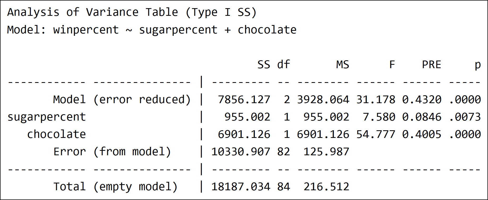

```{r setup, include=FALSE}

# Output options ----------------------------------------------------------

knitr::opts_chunk$set(echo = TRUE)


# Packages ----------------------------------------------------------------

library(kableExtra)
library(tidyverse)
library(supernova)
library(fivethirtyeight)


# Helper functions --------------------------------------------------------

# length() with an na.rm option
length2 <- function(x, na.rm = TRUE) {
  if (na.rm) sum(x[!is.na(x)]) else length(x)
}

# standard error
se <- function(x, na.rm = TRUE) {
  sd(x, na.rm = na.rm) / sqrt(length2(x, na.rm = na.rm))
}

# margin of error
moe <- function(x, p = .975, na.rm = TRUE) {
  se(x, na.rm = na.rm) * qt(p, length2(x, na.rm = na.rm) - 1)
}

# transpose a tibble
transpose_tbl <- function(tbl) {
  t(tbl) %>% as_tibble(rownames = "item", .name_repair = "minimal")
}


# Data --------------------------------------------------------------------

transfer_data_raw <- read_rds("data/transfer_data.Rds")
transfer_responses <- transfer_data_raw %>% select(matches("Q[1-7]"))
score_sheets <- lst(
  Q1 = read_rds("data/score_sheet_Q1.Rds") %>% set_names(paste0("Q1_", names(.))),
  Q5 = read_rds("data/score_sheet_Q5.Rds") %>% set_names(paste0("Q5_", names(.))),
  Q7 = read_rds("data/score_sheet_Q7.Rds") %>% set_names(paste0("Q7_", names(.)))
)

# Score data --------------------------------------------------------------

normalize_equation <- function(x) {
  str_to_lower(x) %>%
    str_replace_all("bo", "b0") %>%
    # put spaces around + and =
    str_replace_all("(=|\\+)", " \\1 ") %>%
    str_squish() %>%
    # make asterisk multiplication implicit
    str_remove_all("\\*")
}

transfer_data <- transfer_data_raw %>% 
  rename(Q1_response = Q1, Q5_response = Q5, Q7_response = Q7) %>% 
  mutate(Q1_normalized = normalize_equation(Q1_response)) %>% 
  left_join(score_sheets$Q1, by = "Q1_normalized") %>% 
  left_join(score_sheets$Q5, by = "Q5_response") %>% 
  left_join(score_sheets$Q7, by = "Q7_response") %>% 
  mutate(
    Q1_correct = Q1_GLM + Q1_y + Q1_intercept + Q1_two_b + Q1_two_x + Q1_error == 6,
    Q1_correct = ifelse(is.na(Q1_veto), Q1_correct, FALSE),
    Q6 = str_replace(Q6, "8.57", "0.0857")
  )
```


## Course Description

The data collected for this investigation were collected across two quarters (F18, W19) at the University of California, Los Angeles. Demographic information about the participants is reported in the tables below.

### Combined Demographics

```{r demographics_all}
transfer_data %>% 
  mutate(sex = fct_explicit_na(sex)) %>% 
  count(sex)
transfer_data %>% 
  mutate(race_ethnic = fct_explicit_na(race_ethnic) %>% fct_lump(5)) %>% 
  count(race_ethnic)
```

### Counts by Term

```{r counts_by_term}
# Completed the course
transfer_data %>% 
  count(term) %>% 
  add_row(term = "Total", n = sum(.$n))

# Completed the target items
transfer_data %>% 
  select(term, Q1_response, Q2, Q3, Q4, Q5_response, Q6, Q7_response) %>% 
  na.omit() %>% 
  count(term) %>% 
  add_row(term = "Total", n = sum(.$n))
```


### Comparing Class Performance on Assessments

Each quarter lasted ten weeks during which students completed the full course. Students were scored on their homework completion, and completed five quizzes and a final exam. The relevant questions on transfer were given as an optional extra credit section at the end of the final exam, but for comparison, the mean scores on all of the classwork are given here (values in parentheses indicate the margin of error).

```{r compare_classes}
homework_aggregate <- transfer_data %>% 
  gather(week, homework, starts_with("hw_")) %>% 
  group_by(id) %>% 
  summarize(homework = mean(homework, na.rm = TRUE) * 100)

assignment_means <- left_join(transfer_data, homework_aggregate, by = "id") %>% 
  group_by(term) %>% 
  summarize_at(vars(homework, starts_with("quiz_"), final_exam), mean, na.rm = TRUE) %>% 
  gather(assignment, mean, -term) %>% 
  spread(term, mean)

assignment_moes <- left_join(transfer_data, homework_aggregate, by = "id") %>% 
  group_by(term) %>% 
  summarize_at(vars(homework, starts_with("quiz_"), final_exam), moe, na.rm = TRUE) %>% 
  gather(assignment, moe, -term) %>% 
  spread(term, moe)

tibble(
  Assignment = c("Final Exam", "Homework", paste("Quiz", 1:5)),
  F18 = sprintf("%.2f (%.2f)", assignment_means$F18, assignment_moes$F18),
  W19 = sprintf("%.2f (%.2f)", assignment_means$W19, assignment_moes$W19)
)
```


## Context

On the final exam, students answered a subset of questions about the `fivethirtyeight::candy_rankings` dataset. In this dataset, `winpercent` is a variable denoting how often a candy is preferred compared to the others it was presented with. There are additionally a number of variables describing different features of the candy like `sugarpercent` (the proportion of sugar in the candy) and `chocolate` (the boolean indicator of whether the candy contained chocolate). 

The following seven questions were asked following the final exam in both classes. In this iteration of the course, students had only covered up to single predictor, between-subjects models, including categorical and continuous predictors. These questions all pertained to two-predictor models, e.g. $winpercent_i = \beta_0 + \beta_1 * chocolate_i + \beta_2 * sugarpercent_i$.


## Transfer Items

Before being presented with any of the transfer questions, students were presented with the `lm()` and `supernova()` output for the two models below.

```{r model_chocolate}
(model_chocolate <- lm(winpercent ~ chocolate, data = candy_rankings))
supernova(model_chocolate)
```


```{r model_sugar}
(model_sugar <- lm(winpercent ~ sugarpercent, data = candy_rankings))
supernova(model_sugar)
```

```{r model_chocolate_sugar}
(model_chocolate_sugar <- lm(winpercent ~ chocolate + sugarpercent, data = candy_rankings))
supernova(model_chocolate_sugar)
```

```{r model_sugar_chocolate}
(model_sugar_chocolate <- lm(winpercent ~ sugarpercent + chocolate, data = candy_rankings))
supernova(model_sugar_chocolate)
```


### Q1: Inventing GLM notation

Question 1 asked students to consider the possibility of creating a single model that included both chocolate and sugarpercent as predictors, and try to “represent the two-predictor model in GLM notation” using regular letters (e.g., b1 for b1, or Xi for Xi). They typed their responses into a standard HTML input box. These responses were first normalized (the normalization function used can be found in the setup code chunk of this file) and the normalized responses were coded inductively by the researchers. The proportions of each coded concept are given in the table below.

```{r transfer_Q1}
transfer_data %>% 
  filter(!is.na(Q1_normalized), is.na(Q1_veto)) %>% 
  # only look at the scoring columns
  select(starts_with("Q1_"), -Q1_response, -Q1_normalized, -Q1_veto) %>%
  # rename for convenience
  set_names(str_remove(names(.), "^Q1_")) %>% 
  # tally / compute proportions
  map_df(mean, na.rm = TRUE) %>% 
  select(correct, everything()) %>%
  transpose_tbl() %>% 
  set_names(c("concept", "proportion"))
```

### Q1: By Term

```{r transfer_Q1_by_term}
transfer_data %>% 
  filter(!is.na(Q1_normalized), is.na(Q1_veto)) %>% 
  # only look at the scoring columns
  select(term, starts_with("Q1_"), -Q1_response, -Q1_normalized, -Q1_veto) %>%
  # rename for convenience
  set_names(str_remove(names(.), "^Q1_")) %>% 
  # tally / compute proportions
  group_by(term) %>% 
  summarize_all(mean, na.rm = TRUE) %>% 
  select(term, correct, everything()) %>%
  transpose_tbl() %>% 
  {.[2:nrow(.), ]} %>% 
  set_names(c("concept", "F18", "W19"))
```


### Q2-4: Reasoning about PRE, SST, and SSE in the New model

Students were next asked three multiple choice questions asking them to make predictions about PRE, SST, and SSE for the new two-variable model. Questions and a summary of responses are shown below.

```{r mc_summaries}
mc_summarize <- function(data, column, other_groups = NULL) {
  data %>%
    select_at(vars(column, other_groups)) %>% 
    na.omit() %>%
    group_by_at(vars(column, other_groups)) %>%
    summarize(n = n()) %>% 
    ungroup()
}

count_to_prop <- function(data, column = "n", na.rm = FALSE) {
  data %>% mutate_at(vars(column), ~ . / sum(., na.rm = na.rm))
}

summaries <- map(
  lst(Q2 = "Q2", Q3 = "Q3", Q4 = "Q4", Q6 = "Q6"), 
  ~mc_summarize(transfer_data, .)
)
```

#### PRE
```{r}
summaries$Q2 %>% count_to_prop()
summaries$Q2 %>% select(n) %>% chisq.test()
```

#### SST
```{r}
summaries$Q3 %>% count_to_prop()
summaries$Q3 %>% select(n) %>% chisq.test()
```

#### SSE
```{r}
summaries$Q4 %>% count_to_prop()
summaries$Q4 %>% select(n) %>% chisq.test()
```

### Q2-4 by term

```{r mc_analysis_by_term_function}
summaries_by_term <- map(
  lst(Q2 = "Q2", Q3 = "Q3", Q4 = "Q4", Q6 = "Q6"), 
  function(x) mc_summarize(transfer_data, x, "term") %>% spread(term, n)
) 
```

#### PRE
```{r}
summaries_by_term$Q2 %>% count_to_prop(c("F18", "W19"))
```

#### SST
```{r}
summaries_by_term$Q3 %>% count_to_prop(c("F18", "W19"))
```

#### SSE
```{r}
summaries_by_term$Q4 %>% count_to_prop(c("F18", "W19"))
```


### Q5: Why is the SSE for the new model smaller? 

After answering the previous questions, students moved on to a new page on which they were informed that, in fact, the SSE is lower for the two-predictor model than for either of the single-predictor models (they were prevented from navigating back to modify their answer to the prior question). Given this new information, students were asked on an open-response question why they thought the SSE for the two-predictor model would be smaller. These responses were again coded inductively by the authors, and the proportions of each coded concept are given in the table below.

```{r transfer_Q5}
transfer_data %>% 
  filter(!is.na(Q5_response)) %>% 
  # only look at the scoring columns
  select(starts_with("Q5_"), -Q5_response, -Q5_notes) %>%
  # rename for convenience
  set_names(str_remove(names(.), "^Q5_")) %>% 
  # tally / compute proportions
  map_df(mean, na.rm = TRUE) %>% 
  transpose_tbl() %>%
  set_names(c("concept", "proportion"))
```

### Q5 by term

```{r}
transfer_data %>% 
  filter(!is.na(Q5_response)) %>% 
  # only look at the scoring columns
  select(term, starts_with("Q5_"), -Q5_response, -Q5_notes) %>%
  # rename for convenience
  set_names(str_remove(names(.), "^Q5_")) %>% 
  # tally / compute proportions
  group_by(term) %>% 
  summarize_all(mean, na.rm = TRUE) %>% 
  # select(term, correct, everything()) %>%
  transpose_tbl() %>% 
  {.[2:nrow(.), ]} %>% 
  set_names(c("concept", "F18", "W19"))
```


### Q6: Making predictions with new model

To test their understanding of model predictions, in Question 6, students were given the best fitting values of the new model and the corresponding ANOVA table (see output below) and were asked to predict the win percentage for a candy that contains chocolate (see Table 4 for the question and the answer choices). This was a difficult transfer question for a few reasons. First, the way the question is phrased does not explicitly mention sugar percentage, though it is included in the model and the prior four questions have been concerning a model with both chocolate and sugar percentage. Second, in the ANOVA table, sugar percentage is not a significant predictor (evidenced by the p value), which may lead students to discount it. Third, the correct answer was an expression (38.26 + 18.27 + 8.57*sugarpercent) rather than a single value. The model modifies the prediction according to sugar percentage, and since students were not given a specific value for sugar percentage, the correct answer needs to include sugar percentage as a variable. Students had no experience with predictions left as algebraic expressions in the course. And lastly, students were never shown the correct GLM equation for the best fitting two-predictor model. Students were primarily working from their own intuition about what that would be.

```{r, echo = FALSE, out.width = '100%'}


```

```{r}
summaries$Q6 %>% count_to_prop()
```

### Q6 by term
```{r}
summaries_by_term$Q6 %>% count_to_prop(c("F18", "W19"))
summaries_by_term$Q6 %>% select(F18) %>% chisq.test()
summaries_by_term$Q6 %>% select(W19) %>% chisq.test()
```

### Q7: Why is the ANOVA table for the chocolate then sugar model different from the sugar then chocolate model?

Finally, students were queried about the effect of sequentially adding variables into a complex model. Students were told that we ran two models where the order of the predictor variables was flipped. That is, in the first output below, they were shown the model where chocolate was entered first then sugar percent. In the next output, they were shown the model where sugar percent was entered before chocolate. Question 7 asked students to explain why the ANOVA tables showed different values depending on which variable was entered into the model first. These responses were again coded inductively by the authors, and the proportions of each coded concept are given in the table below the outputs.

```{r, echo = FALSE, out.width = '100%'}




before <- transfer_data %>% 
  filter(!is.na(Q7_response)) %>% 
  # only look at the scoring columns
  select(starts_with("Q7_"), -Q7_response, -Q7_notes) %>%
  # rename for convenience
  set_names(str_remove(names(.), "^Q7_")) %>% 
  # tally / compute proportions
  mutate(none_of_these = rowSums(.) == 0)

# tally / compute proportions before removing none_of_these
prop_before <- before %>% 
  map_df(mean, na.rm = TRUE) %>% 
  transpose_tbl() %>%
  set_names(c("concept", "proportion"))

# join and compare with removed people
before %>% 
  filter(!none_of_these) %>% 
  map_df(mean, na.rm = TRUE) %>% 
  transpose_tbl() %>%
  set_names(c("concept", "proportion")) %>% 
  right_join(prop_before, by = "concept",  suffix = c(" after removal", ""))
```

### Q7 by term

```{r}
before_by_term <- transfer_data %>% 
  filter(!is.na(Q7_response)) %>% 
  # only look at the scoring columns
  select(term, starts_with("Q7_"), -Q7_response, -Q7_notes) %>%
  # rename for convenience
  set_names(str_remove(names(.), "^Q7_")) %>% 
  # tally / compute proportions
  mutate(none_of_these = rowSums(select(., -term)) == 0)
  
# tally / compute proportions before removing none_of_these
prop_before_by_term <- before_by_term %>% 
  group_by(term) %>% 
  summarize_all(mean, na.rm = TRUE) %>% 
  transpose_tbl() %>% 
  {.[2:nrow(.), ]} %>% 
  set_names(c("concept", "F18", "W19"))

# join and compare with removed people
before_by_term %>% 
  filter(!none_of_these) %>% 
  group_by(term) %>% 
  summarize_all(mean, na.rm = TRUE) %>% 
  transpose_tbl() %>% 
  {.[2:nrow(.), ]} %>% 
  set_names(c("concept", "F18", "W19")) %>% 
  right_join(prop_before_by_term, by = "concept",  suffix = c(" after removal", "")) %>% 
  select(concept, F18, W19, everything())
```

